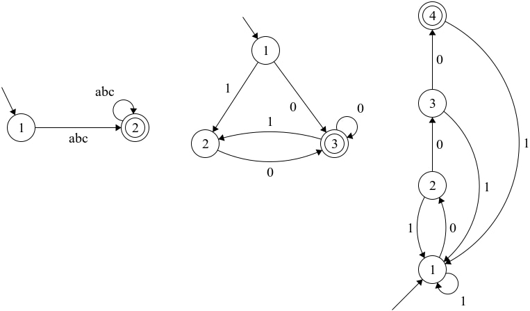

## Задача №1
Разобъем множество всех строк над алфавитом `{a, b}` на несколько групп, которые полностью покрывают все возможные слова:
1) `.*ba...a` - на конце нечетное количество `a`
2) `.*ba...a` - на конце четное количество `a`
3) `a...a` - нечетное количество `a`
4) `a...a` - четное количество `a`
Заметим, что это действительно покрытие: если в строке есть `b`, то сработают первые три пункта, иначе - три последних.

Дальше несложно заметить, что группы `1`, `3` покрываются данными примерами, а `2`, `4` - нет. Следовательно регуряные выражения равны.
## Задача №2
Решение будет отличаться от решения в предыдущим дз, только разница в том, что мы будем кодировать `ASCII` описания ребер и вершин в бинарную строку.
Пусть `S` - алфавит для описания языка, на котором задается названия ребер и вершин в автомате (пояснения к автомату, может быть его номер). Назовем его `L`. Возьмем 4 символа: `A`, `B`, `C`, `D`. Дальше нужно научиться записывать слова: "вершинa", "ребро" и "автомат". Параметра у вершины: является ли она терминальной и ее описание. Будем делать так: для начала оборачивать слово в буквы `A`, внутри первым символом будет `0` или `1` - в зависимости от терминальности, и дальше бинарный код описания на языке `L` (переведенное в бинарную строку длины `8`, так как `char` - это один байт), обернутое в `B`. Для слова ребро будем оборачивать его в `C`, внутри записать исходящую вершину, затем описание ребра, обернутое в `B`, а потом входящую. И теперь осталось описать слово автомат: обернем в символы `D`, а внутри - отсортированный список ребер. Таким образом, у нас каждый автомат описывается единственным образом, а слово не может относится к более чем одному автомату.

Коды будут:
1) `DCBBA0B00110001BACCA0B00110001BAB011000010110001001100011BA1B00110010BACCA1B00110010BAB011000010110001001100011BA1B00110010BACD`
2) `DCBBA0B00110001BACCA0B00110001BAB00110001BA0B00110010BACCA0B00110001BAB00110000BA1B00110011BACCA0B00110010BAB00110000BA1B00110011BACCA1B00110011BAB00110001BA0B00110010BACCA1B00110011BAB00110000BA1B00110011BACD`
3) `DCBBA0B00110001BACCA0B00110001BAB00110001BA0B00110001BACCA0B00110001BAB00110000BA0B00110010BACCA0B00110010BAB00110000BA0B00110011BACCA0B00110011BAB00110000BA1B00110100BACCA1B00110100BAB00110001BA0B00110001BACCA0B00110011BAB00110001BA0B00110001BACCA0B00110010BAB00110001BA0B00110001BACD`


Сайт для перевода чаров [тут](https://www.rapidtables.com/convert/number/ascii-to-binary.html).
## Задача №3
Код в файле `main.py`, тесты - коды из предыдущего задания.
Запуск: `python main.py input.txt`
Выводы для тестов:

1)
```
Found edge name is  "" to (vertex "1" with terminality: False)
Found edge from (vertex "1" with terminality: False) name is  "abc" to (vertex "2" with terminality: True)
Found edge from (vertex "2" with terminality: True) name is  "abc" to (vertex "2" with terminality: True)
```
2)
```
Found edge name is  "" to (vertex "1" with terminality: False)
Found edge from (vertex "1" with terminality: False) name is  "1" to (vertex "2" with terminality: False)
Found edge from (vertex "1" with terminality: False) name is  "0" to (vertex "3" with terminality: True)
Found edge from (vertex "2" with terminality: False) name is  "0" to (vertex "3" with terminality: True)
Found edge from (vertex "3" with terminality: True) name is  "1" to (vertex "2" with terminality: False)
Found edge from (vertex "3" with terminality: True) name is  "0" to (vertex "3" with terminality: True)
```
3)
```
Found edge name is  "" to (vertex "1" with terminality: False)
Found edge from (vertex "1" with terminality: False) name is  "1" to (vertex "1" with terminality: False)
Found edge from (vertex "1" with terminality: False) name is  "0" to (vertex "2" with terminality: False)
Found edge from (vertex "2" with terminality: False) name is  "0" to (vertex "3" with terminality: False)
Found edge from (vertex "3" with terminality: False) name is  "0" to (vertex "4" with terminality: True)
Found edge from (vertex "4" with terminality: True) name is  "1" to (vertex "1" with terminality: False)
Found edge from (vertex "3" with terminality: False) name is  "1" to (vertex "1" with terminality: False)
Found edge from (vertex "2" with terminality: False) name is  "1" to (vertex "1" with terminality: False)
```
